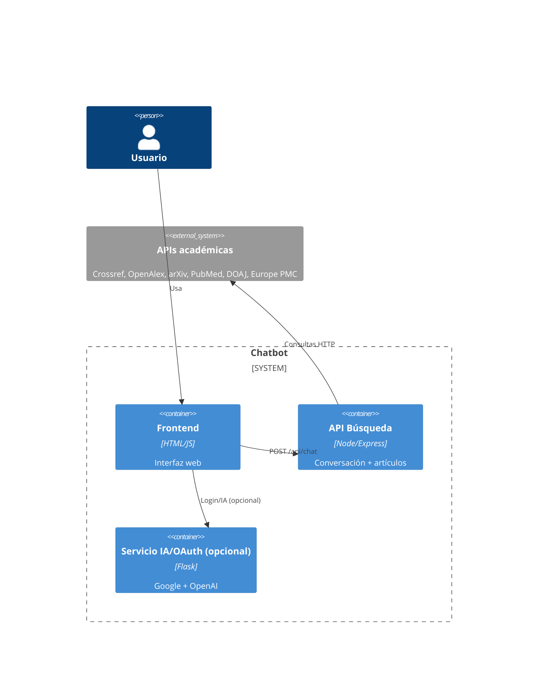

# Documento de Arquitectura de Software

## 1. Resumen (4+1 / C4)

- Estilo: Cliente-Servidor + Microservicio especializado (bajo acoplamiento). Backend Node.js maneja intenciones y consulta fuentes abiertas; Flask (opcional) para OAuth/IA generativa.
- Patrones: Capas (config, middleware, controlador, servicio, dominio, adaptador), Pipeline de Handlers (OCP/ISP), Rate Limiter (seguridad), Configuración externa.
- Atributos: Seguridad (CORS allowlist, headers, rate limit), Mantenibilidad (capas, SOLID, pruebas), Escalabilidad (I/O async y `Promise.allSettled`).

### Vista de Contexto


### Vista de Contenedores
```mermaid
C4Container
Container(api, "API Node", "Express"){
  Component(config, "Config"),
  Component(mw, "Middleware (CORS, rate, headers)"),
  Component(ctrl, "ChatController"),
  Component(svc, "ChatbotService"),
  Component(dom, "Dominio (parser, sesión)"),
  Component(adapter, "SearchAdapter (APIs)")
}
```

### Vista de Componentes (Desarrollo)
- `ChatbotService` coordina handlers: saludos, small talk, opinión con resumen, referencias, paginación, búsqueda.
- `SearchAdapter` integra fuentes con `Promise.allSettled`, deduplica y filtra.
- `SearchSession` mantiene estado de paginación y referencias.

### Vista de Proceso (flujo principal)
1) Usuario envía texto → 2) Controller valida → 3) Service normaliza y recorre handlers → 4) Adapter consulta fuentes → 5) Service devuelve respuesta.

### Vista Física (despliegue)
- Frontend estático (Nginx/VSCode Live Server).
- API Node en `:3000` (PM2/Docker). Flask opcional en `:5000`.

## 2. Decisiones y SOLID
- SRP: cada handler tiene una responsabilidad; `SearchSession` solo gestiona estado; `SearchAdapter` solo integra fuentes.
- OCP/ISP: agregar nuevos handlers no requiere modificar `ChatbotService`; interfaz mínima `ChatHandler`.
- LSP: todos los handlers implementan el mismo contrato (`canHandle`/`handle`).
- DIP: `ChatbotService` recibe `handlers`, `sessionFactory` y `searchGateway` por inyección.

## 3. Atributos de Calidad (evidencia)
- Seguridad: `src/middleware/*`, CORS con allowlist, cabeceras, rate limiter.
- Mantenibilidad: capas + pruebas (se sugiere `node --test`), funciones puras en dominio.
- Escalabilidad: consultas concurrentes y no bloqueantes a proveedores.

## 4. Guía de inicio
```bash
cd ProyectoChatbot-main/backend
npm install
npm start   # http://localhost:3000/api/chat
```
Abrir `ProyectoChatbot-main/frontend/index.html` en el navegador.

## 5. Captura de contraste (antes vs. después)
- Antes: ruta única en Express que delegaba en función monolítica; sin seguridad ni estructura.
- Después: capas, handlers SOLID, rate limit, CORS, búsqueda multi-fuente, respuestas de opinión con resumen + referencias bajo demanda.

## 6. Retos y próximos pasos
- Añadir pruebas automatizadas end-to-end.
- Cachear resultados en memoria/Redis para latencias menores.
- Instrumentación con métricas e integración de logs centralizados.